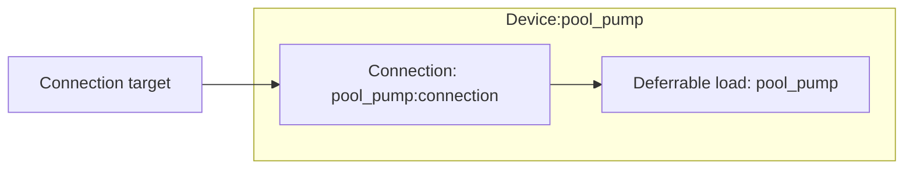

# Deferrable load modeling

The deferrable load device composes one deferrable load model element and one [Connection](../model-layer/connections/connection.md).

## Model elements created

The adapter creates two model elements:

| Model Element                                          | Name                | Purpose                                            |
| ------------------------------------------------------ | ------------------- | -------------------------------------------------- |
| Deferrable load                                        | `{name}`            | Per-window energy requirements with priced deficit |
| [Connection](../model-layer/connections/connection.md) | `{name}:connection` | Network → load, open only while a window is open   |

## Architecture details

### Window scheduling

Calendar events define run windows.
For each window $i$ with start $s_i$, end $e_i$, and required energy $E_i$ (from the event text, kWh), two boundary-aligned cumulative profiles drive the load:

- **Capacity** opens at each window's start: $C(t) = \sum_{i:\, s_i \le t} E_i$
- **Requirement** is due by each window's end: $E_{\text{req}}(t) = \sum_{i:\, e_i \le t} E_i$

The connection's power limit is masked by window presence, so power can only flow while a window is open, and is capped by the configured max power.

### Priced shortfall

The requirement is not a hard constraint.
A non-decreasing deficit variable $D(t) \ge E_{\text{req}}(t) - E(t)$ tracks the locked-in shortfall — a missed deadline stays priced even if absorption later catches up — and each deficit increment is charged at the shortfall price for the boundary where it locks in:

$$
\text{cost} = \sum_t p_{\text{deficit}}(t) \cdot \left( D(t) - D(t-1) \right)
$$

Absorption beyond the total requirement is priced at the overage price.
This keeps the optimization feasible when a window physically cannot fit its energy, while making the optimizer work to fit it.

## Devices created

The deferrable load element creates a single Home Assistant device:

| Device          | Name     | Created when | Purpose                           |
| --------------- | -------- | ------------ | --------------------------------- |
| Deferrable Load | `{name}` | Always       | Power, absorbed energy, shortfall |

## Parameter mapping

| User configuration | Model element(s)               | Model parameter       | Notes                             |
| ------------------ | ------------------------------ | --------------------- | --------------------------------- |
| `window_calendar`  | Deferrable load `{name}`       | `capacity`/`required` | Cumulative window energy profiles |
| `deficit_price`    | Deferrable load `{name}`       | `deficit_price`       | Defaults to \$10/kWh in the flow  |
| `overage_price`    | Deferrable load `{name}`       | `overage_price`       | Optional                          |
| `max_power`        | Connection `{name}:connection` | Power limit segment   | Masked by window presence         |

## Output mapping

The adapter maps model outputs to deferrable-load-specific sensor names:

| Model output                      | Sensor name       | Description                      |
| --------------------------------- | ----------------- | -------------------------------- |
| Connection power                  | `power`           | Power drawn by the load          |
| `DEFERRABLE_LOAD_ENERGY_ABSORBED` | `energy_absorbed` | Cumulative energy absorbed       |
| `DEFERRABLE_LOAD_ENERGY_DEFICIT`  | `energy_deficit`  | Locked-in shortfall per deadline |

See [Deferrable Load Configuration](../../user-guide/elements/deferrable_load.md#sensors-created) for complete sensor documentation.

## Next steps

- :material-file-document:{ .lg .middle } **Deferrable load configuration**

    ---

    Configure deferrable loads in your Home Assistant setup.

    [:material-arrow-right: Deferrable load configuration](../../user-guide/elements/deferrable_load.md)

- :material-car-electric:{ .lg .middle } **EV modeling**

    ---

    The EV's trip sink uses the same deferrable load element.

    [:material-arrow-right: EV modeling](ev.md)

- :material-connection:{ .lg .middle } **Connection model**

    ---

    How power limits, efficiency, and pricing are applied.

    [:material-arrow-right: Connection formulation](../model-layer/connections/connection.md)

