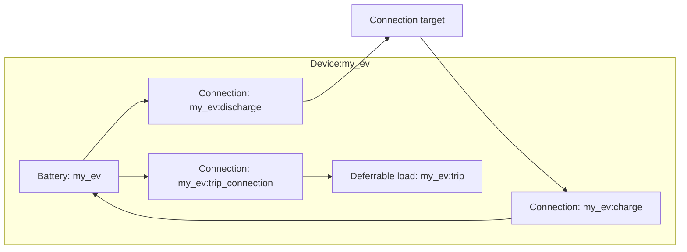

# EV modeling

The EV device composes a [Battery](../model-layer/elements/battery.md), a deferrable load, and three [Connection](../model-layer/connections/connection.md) elements.
The battery represents the physical EV pack, while the deferrable trip load captures per-trip energy requirements from calendar data.

## Model elements created

The adapter creates five model elements:

| Model Element                                          | Name                     | Purpose                                             |
| ------------------------------------------------------ | ------------------------ | --------------------------------------------------- |
| [Battery](../model-layer/elements/battery.md)          | `{name}`                 | Physical EV battery with SOC tracking               |
| [Connection](../model-layer/connections/connection.md) | `{name}:charge`          | Home charging (network → EV), active when connected |
| [Connection](../model-layer/connections/connection.md) | `{name}:discharge`       | V2G discharge (EV → network), active when connected |
| Deferrable load                                        | `{name}:trip`            | Trip energy requirement with a priced shortfall     |
| [Connection](../model-layer/connections/connection.md) | `{name}:trip_connection` | EV battery → trip load, active when away            |

## Architecture details

### Connected and disconnected states

The EV alternates between two states:

- **Connected** (plugged in at home): The home charge/discharge connections are active, trip connections are zeroed
- **Away** (on a trip): The home connections are zeroed, trip and public connections are active

The trip calendar is authoritative for the future: the away mask is derived from calendar event windows aligned to the horizon.
The live plugged-in binary sensor overrides only the current interval, so early returns and unplanned absences are reflected immediately.
The masks multiply the connection power limits.

### Trip energy modeling

Calendar events define trip windows.
For each trip, the required energy is:

$$
E_{\text{trip}} = d \cdot r
$$

where $d$ is the trip distance (from the calendar event location field) and $r$ is the energy-per-distance rate.

Two boundary-aligned profiles drive the deferrable trip load:

- **Capacity** opens at each trip's start: $C_{\text{trip}}(t) = \sum_{i:\, s_i \le t} d_i \cdot r$, so energy can flow into the load from the moment a trip begins.
- **Requirement** is due by each trip's end: $E_{\text{req}}(t) = \sum_{i:\, e_i \le t} d_i \cdot r$.

The cumulative sums let multiple trips within the horizon share the one load.
The requirement is not a hard constraint.
A non-decreasing deficit variable $D(t) \ge E_{\text{req}}(t) - E(t)$ tracks the locked-in shortfall — a missed deadline stays priced even if absorption later catches up — and each deficit increment is charged at the public charging price for the boundary where it locks in:

$$
\text{cost} = \sum_t p_{\text{public}}(t) \cdot \left( D(t) - D(t-1) \right)
$$

This models topping up publicly during the trip: the optimizer covers trip energy from the EV pack whenever home charging is cheaper than the public price, and a trip can never make the optimization infeasible.

### Mid-trip energy tracking

When the car is mid-trip and the odometer updates, HAEO reduces the remaining trip energy requirement:

$$
E_{\text{remaining}} = E_{\text{trip}} - (o_{\text{current}} - o_{\text{disconnect}}) \cdot r
$$

where $o_{\text{current}}$ is the current odometer reading and $o_{\text{disconnect}}$ is the odometer at disconnection.

If the odometer does not update while driving, HAEO conservatively assumes no progress and reserves the full trip energy.

### Public charging

Public charging is modeled as the price on the trip load's shortfall rather than as an explicit grid element.
The optimizer chooses between:

- Pre-charging the EV at home prices before the trip
- Leaving a shortfall to be topped up publicly during the trip at the configured price

The optimizer selects the cheaper option based on current and forecast prices.
Without a configured price the default \$10/kWh applies, making the shortfall a pure feasibility relief valve.
The expected public top-up is exposed as the trip energy shortfall output.

## Devices created

The EV element creates a single Home Assistant device:

| Device | Name     | Created when | Purpose                                 |
| ------ | -------- | ------------ | --------------------------------------- |
| EV     | `{name}` | Always       | Power, energy, SOC, trip, shadow prices |

## Parameter mapping

| User configuration         | Model element(s)                      | Model parameter         | Notes                           |
| -------------------------- | ------------------------------------- | ----------------------- | ------------------------------- |
| `capacity`                 | Battery `{name}`                      | `capacity`              | kWh, time-series boundary array |
| `current_soc`              | Battery `{name}`                      | `initial_charge`        | SOC ratio × capacity            |
| `trip_calendar`            | Battery `{name}:trip`                 | `capacity`/`min_charge` | Cumulative trip energy profiles |
| `max_charge_rate`          | Connection `{name}:charge`            | Power limit segment     | Masked by connected flag        |
| `max_discharge_rate`       | Connection `{name}:discharge`         | Power limit segment     | Masked by connected flag        |
| `energy_per_distance`      | Trip energy calculation               | Multiplied by distance  | kWh/km                          |
| `odometer` pair            | Battery `{name}:trip`                 | `initial_charge`        | Mid-trip progress credit        |
| `public_charging_price`    | Connection `{name}:public_connection` | Pricing segment         | Defaults to \$10/kWh            |
| `efficiency_source_target` | Connection `{name}:discharge`         | Efficiency segment      | Discharge direction             |
| `efficiency_target_source` | Connection `{name}:charge`            | Efficiency segment      | Charge direction                |
| `max_power_source_target`  | Connection `{name}:discharge`         | Power limit segment     | Combined with discharge rate    |
| `max_power_target_source`  | Connection `{name}:charge`            | Power limit segment     | Combined with charge rate       |

## Output mapping

The adapter maps model outputs to EV-specific sensor names:

| Model output              | Sensor name                 | Description                    |
| ------------------------- | --------------------------- | ------------------------------ |
| `{name}:charge` power     | `power_charge`              | Home charge power              |
| `{name}:discharge` power  | `power_discharge`           | V2G discharge power            |
| Calculated                | `power_active`              | Net power (discharge − charge) |
| `BATTERY_ENERGY_STORED`   | `energy_stored`             | Energy in EV battery           |
| Calculated                | `state_of_charge`           | SOC ratio                      |
| Trip load energy absorbed | `trip_energy_delivered`     | Trip energy delivered so far   |
| Trip load energy deficit  | `trip_energy_deficit`       | Expected public top-up energy  |
| Power limit shadow        | `power_max_charge_price`    | Charge limit shadow price      |
| Power limit shadow        | `power_max_discharge_price` | Discharge limit shadow price   |

See [EV Configuration](../../user-guide/elements/ev.md#sensors-created) for complete sensor documentation.

## Next steps

- :material-file-document:{ .lg .middle } **EV configuration**

    ---

    Configure EVs in your Home Assistant setup.

    [:material-arrow-right: EV configuration](../../user-guide/elements/ev.md)

- :material-battery-charging:{ .lg .middle } **Battery model**

    ---

    Mathematical formulation for battery storage.

    [:material-arrow-right: Battery model](../model-layer/elements/battery.md)

- :material-connection:{ .lg .middle } **Connection model**

    ---

    How power limits, efficiency, and pricing are applied.

    [:material-arrow-right: Connection formulation](../model-layer/connections/connection.md)

