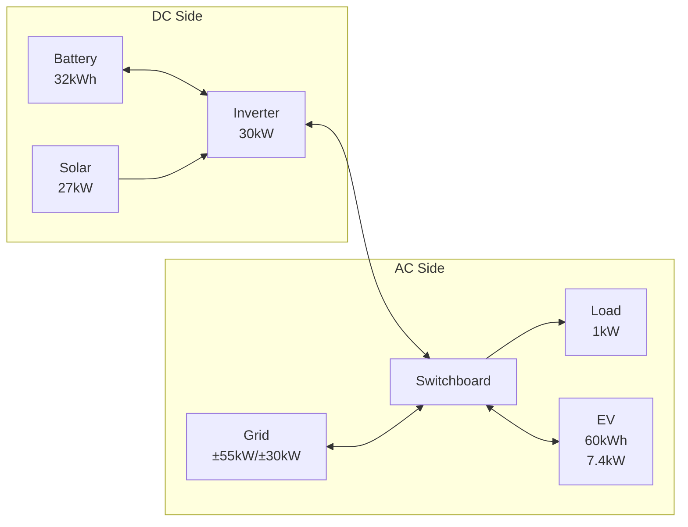

# Adding an EV to Your System

This walkthrough demonstrates adding an Electric Vehicle (EV) to an existing home energy system.
It covers creating a trip calendar, scheduling a trip, and configuring the EV element so HAEO charges the car ahead of departures.

## System overview

After completing this walkthrough, your system will include:

- **Base system**: Inverter, battery, solar, grid, and load (from the [Sigenergy System](sigenergy-system.md) guide)
- **EV**: 60 kWh battery, 7.4 kW home charging, and a trip calendar that drives departure readiness



## Prerequisites

Complete the [Sigenergy System](sigenergy-system.md) walkthrough first.
This guide builds on that configuration and adds a trip calendar and an EV element.

```guide-setup
run_guide("sigenergy-system")
hass.set_state(
    "sensor.ev_battery_state_of_charge",
    "40",
    {
        "unit_of_measurement": "%",
        "device_class": "battery",
        "friendly_name": "EV Battery State of Charge",
    },
)
hass.set_state(
    "binary_sensor.ev_plugged_in",
    "on",
    {"device_class": "plug", "friendly_name": "EV Plugged In"},
)
```

### EV-specific requirements

In addition to the base system, you will need:

- **EV battery SOC sensor**: A sensor reporting the EV's current state of charge
- **Plugged-in sensor** (optional): A binary sensor reporting when the EV is connected to your charger

!!! tip "Where do these sensors come from?"

    These sensors typically come from your EV manufacturer's integration (e.g., Tesla, Hyundai, Kia)
    or from your charger's integration (e.g., Wallbox, Easee, OpenEVSE).

## Step 1: Create a trip calendar

HAEO reads upcoming trips from a Home Assistant calendar.
Create a dedicated [Local Calendar](https://www.home-assistant.io/integrations/local_calendar/) so trip events stay separate from your personal calendars.

```guide
add_local_calendar(page, calendar_name="EV Trips")
```

## Step 2: Schedule a trip

Create an event for each planned trip.
The event's start and end mark when the car is away; the **location field carries the trip distance** (e.g., `50 km`).

```guide
create_calendar_event(
    page,
    title="Commute",
    location="50 km",
    start_time="09:00",
    end_time="17:00",
)
```

!!! tip "Distance format"

    Enter a number followed by a unit — `50 km`, `30 mi`, and similar forms are recognized.
    Events without a parsable distance are ignored.

## Step 3: Add the EV element

Navigate to the HAEO integration page and add the EV element.

```guide
page.navigate_to_settings()
page.navigate_to_integrations()
page.navigate_to_integration("HAEO")
```

Configure the EV with battery details, charging rate, and the trip calendar.
The EV connects to the **Switchboard** — the node HAEO automatically created
with your hub — where the home charger is wired.

```guide
add_ev(
    page,
    name="Commuter EV",
    connection="Switchboard",
    capacity=ConstantInput(60),
    energy_per_distance=ConstantInput(0.15),
    current_soc=EntityInput("EV battery state of charge", "EV Battery State of Charge"),
    max_charge_rate=ConstantInput(7.4),
    trip_calendar="EV Trips",
    connected=EntityInput("EV plugged in", "EV Plugged In"),
    public_charging_price=ConstantInput(0.60),
)
```

!!! tip "Energy per distance"

    Set this to your EV's average energy consumption in kWh/km.
    For example, 0.15 kWh/km means 15 kWh per 100 km.
    Check your EV's trip computer for a realistic average.

## Step 4: Verify setup

After completing configuration, verify that all elements were created successfully.

```guide
verify_setup(page)
```

## Verification

Navigate to **Settings → Devices & Services → HAEO** to view the complete system.

### Expected device hierarchy

| Element     | Type | Key Sensors                                             |
| ----------- | ---- | ------------------------------------------------------- |
| Commuter EV | EV   | Charge power, energy stored, SOC, trip energy delivered |

The EV element adds to the existing base system elements (Inverter, Battery, Solar, Grid, Load).

### Key EV sensors

- `sensor.commuter_ev_charge_power` — Optimal charging power (kW)
- `sensor.commuter_ev_discharge_power` — V2G discharge power (kW), if configured
- `sensor.commuter_ev_energy_stored` — Current energy in the EV battery (kWh)
- `sensor.commuter_ev_state_of_charge` — EV battery percentage (%)
- `sensor.commuter_ev_trip_energy_delivered` — Trip energy delivered so far (kWh)
- `sensor.commuter_ev_trip_energy_shortfall` — Trip energy expected to be topped up publicly (kWh)

All sensors include a `forecast` attribute with optimized future values.

### What to expect

With the commute scheduled:

- **Overnight**: HAEO charges the EV during the cheapest electricity periods
- **Before departure**: The EV reaches sufficient charge for the trip distance
- **During the trip**: The EV is away; a trip energy shortfall appears only if home charging could not cover the trip
- **After return**: HAEO resumes home charging based on the remaining schedule

The optimizer balances EV charging against battery storage, solar generation, and grid prices to minimize total system cost.

## Next steps

<div class="grid cards" markdown>

- :material-car-electric:{ .lg .middle } **EV element reference**

    ---

    Detailed configuration options for EV elements.

    [:material-arrow-right: EV configuration](../user-guide/elements/ev.md)

- :material-math-integral:{ .lg .middle } **EV modeling**

    ---

    Mathematical details of how EVs are modeled.

    [:material-arrow-right: EV modeling](../modeling/device-layer/ev.md)

- :material-home-lightning-bolt:{ .lg .middle } **Automation examples**

    ---

    Use optimization results to control your EV charger.

    [:material-arrow-right: Automations](../user-guide/automations.md)

</div>
